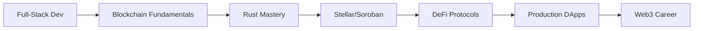

[](https://github.com/antoniocarol)

<h1 align="center">🚀 Antonio Carolino</h1>
<h3 align="center">Blockchain Developer | Building the Future of Decentralized Finance</h3>
<h4 align="center">🌎 Full-Stack → Web3 Transition | 🦀 Rust Enthusiast | ⭐ Stellar Ecosystem</h4>

<p align="center">
  
  
  
</p>

---

## 🌟 **About Me**

🔥 **Transitioning from Full-Stack to Web3** - Combining traditional software engineering with blockchain innovation

🦀 **Rust Developer** - Building secure, efficient smart contracts and decentralized applications

⭐ **Stellar Specialist** - Focused on Soroban smart contracts and tokenization solutions

🏆 **Hackathon Ready** - Preparing for HackMeridian 2025 with a revolutionary local tokenization project

💡 **Innovation Focus** - Creating real-world blockchain solutions that solve actual problems

---

## 🚀 **Current Journey**

```rust
impl Developer for Antonio {
    fn current_focus(&self) -> Vec<&str> {
        vec![
            "🦀 Mastering Rust for blockchain development",
            "⭐ Building on Stellar/Soroban platform", 
            "🏗️ Creating tokenization SaaS for local economies",
            "🔒 Smart contract security and best practices",
            "📈 DeFi protocols and tokenomics design"
        ]
    }
}
```

- 🌱 **Currently Learning**: Rust, Soroban Smart Contracts, DeFi Architecture
- 🔭 **Working On**: Local Economy Tokenization Platform (Proof of Volume consensus)
- 🎯 **2024 Goal**: Land first Web3 role and win HackMeridian
- 📫 **Reach me**: carolinosfinances@gmail.com
- 🌐 **Portfolio**: [Coming Soon - Web3 Showcase]

---

## 🛠️ **Tech Stack**

### **🔗 Blockchain & Web3**
<p align="left">
  
  
  
  
  
</p>

### **💻 Full-Stack Foundation**
<p align="left">
  
  
  
  
  
  
</p>

### **🔧 Tools & Infrastructure**
<p align="left">
  
  
  
  
</p>

---

## 🏆 **Highlighted Projects**

### 🌟 **[Local Tokenization SaaS](https://github.com/antoniocarol/local-tokenization)**
> **Revolutionary local economy platform built on Stellar**
- 🦀 **Rust/Soroban** smart contracts for tokenization
- 🔄 **Proof of Volume** consensus mechanism (innovation!)
- 💰 **Revenue sharing** and deflationary tokenomics
- 🛡️ **Anti-fraud** system with KYC/KYB integration
- 📱 **React** frontend with seamless Web3 integration

### ⚡ **[TokenFactory](https://github.com/antoniocarol/token-factory)**
> **Smart contract factory for creating custom loyalty tokens**
- 🏗️ **Modular architecture** for different business types
- 🔒 **Security-first** design with comprehensive testing
- 📊 **Analytics dashboard** for merchant insights
- 🌐 **Cross-ecosystem** interoperability

### 🤖 **[Crypto Trading Bot](https://github.com/antoniocarol/stellar-trading-bot)**
> **AI-powered arbitrage bot for Stellar DEXs**
- 🐍 **Python** algorithms for market analysis
- ⚡ **Real-time** price monitoring and execution
- 📈 **Risk management** and profit optimization
- 🔌 **Stellar SDK** integration

---

## 📊 **GitHub Analytics**

<div align="center">
  
  
</div>

<div align="center">
  
</div>

---

## 🎯 **Web3 Learning Journey**



**Completed:**
- ✅ Full-Stack Development (React, Node.js, Python)
- ✅ Blockchain Fundamentals & Web3 Concepts
- ✅ Rust Programming Language Basics

**In Progress:**
- 🔄 Advanced Rust & Systems Programming
- 🔄 Soroban Smart Contract Development
- 🔄 DeFi Architecture & Tokenomics

**Next Steps:**
- 📅 Smart Contract Security & Auditing
- 📅 Cross-chain Development
- 📅 Advanced DeFi Strategies

---

## 🌐 **Connect With Me**

<p align="center">
  <a href="https://linkedin.com/in/antoniocarolino" target="_blank">
    
  </a>
  <a href="mailto:carolinosfinances@gmail.com" target="_blank">
    
  </a>
  <a href="https://twitter.com/your_handle" target="_blank">
    
  </a>
</p>

---

## 💡 **Philosophy**

> *"Building bridges between traditional finance and decentralized systems. Every line of code is a step towards a more inclusive financial future."*

**🚀 Open to opportunities in Web3, DeFi, and blockchain innovation!**

---

<div align="center">
  
</div>
